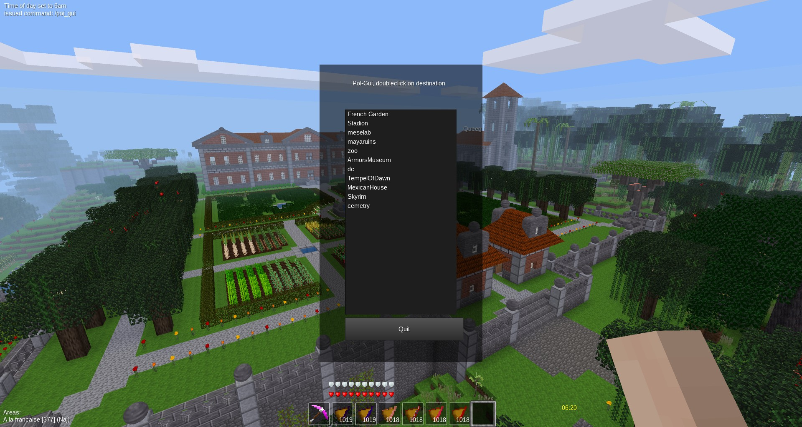

# Points of Interest

A Mod for Minetest.

This Mod adds PoI's, Point's of Interest to your World.
If you have set a PoI, you can everytime jump back to the PoI with a simple Chatcommand or easy with the GUI.

### /poi_list [-a]  [-f]  [-c]  [-i <Number>]
Lists Points of Interest. 
Option -a: List all Points of Interest with Coordinates 
Option -f: Lists forbidden Chars or Names 
Option -c: Lists the Categories of PoI's 
Option -i <Number>: Lists all Entrys of the given Categorienumber or Categoriename 

### /poi_jump [Name]
Jumps to a Point of Interest.

### /poi_gui
Opens a simple GUI, where you can Double-Click the Points to Jump.

### This commands demands the Priv "poi":
### /poi_set [Name][, Categorie[number]]
Set's a new Point of Interest. You can't overwrite an existing POI. 
If you don't set a Categorienumber or Categoriename, it will given 1 by default. 
You can change the Categorie of an Point, if you set the Point with a different Categorienumber or Categoriename. 
This Action will be logged.

### /poi_delete [Name]
Deletes a Point of Interest. You can't delete an unknown POI. 
This Action will be logged.

### /poi_move [Name]
This command overwrites the Coordinates of the given POI with your current Coordinates. 
This Action will be logged.

### /poi_rename [Name1],[Name2]
This command renames an existing Point [Name1] of Interest to Point of Interest [Name2]. [Name2] can't have the name of an already existing Point. 
This Action will be logged.

### /poi_reload
If the List of POI's are in any kind corrupted, you can reload the List without a new Serverstart.

### /poi_validate
Checks the List of Entrys for invalid Names or Positions. If found an Entry, the command deletes it. 
This Function checks the Entries for a Categorienumber, if there is no, it sets to 1 per default. 
This Action will be logged.

As Admin, you can grant Privs for the Player.

## Privileges

### interact: 
/poi_jump [name] 
/poi_list [-a]  [-f]  [-c]  [-i <Categorie[number>]] 
/poi_gui 

### poi: 
/poi_set [name][, Categorie[number]] 
/poi_delete [name] 
/poi_reload 
/poi_move [name] 
/poi_rename [name1], [name2] 
/poi_validate  

With this Privileg, you have access to the grafical POI-Manager:

## Install

Move your Download to the Mods-Folder.

## Depends

none

## License

License: cc0-1.0
